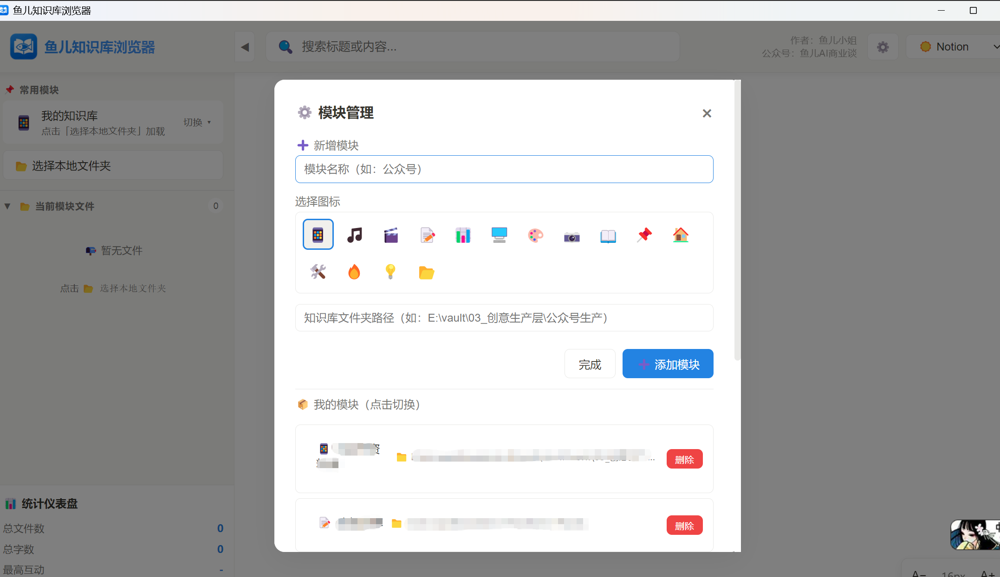
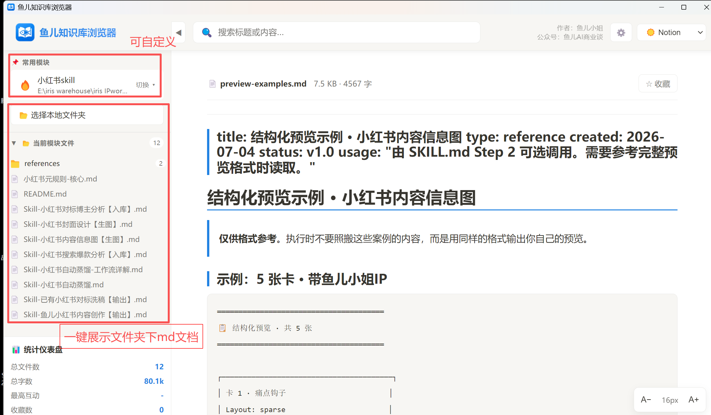
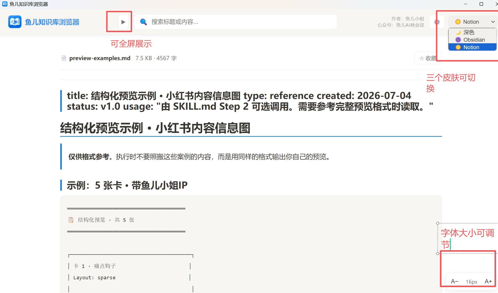

<div align="center">
  
  <h1 align="center">🐟 鱼儿知识库浏览器</h1>
  <p align="center">
    <strong>本地知识库 Markdown 预览工具 · 跨平台桌面应用</strong>
  </p>
  <p align="center">
    
    
    
    
    
  </p>
  <br>
</div>

<!--
鱼儿知识库浏览器 (Fish Knowledge Browser)
关键词：Markdown 知识库浏览器 / Obsidian 笔记预览工具 / 本地 Markdown 阅读器 / Electron 桌面应用
搜索标签：markdown viewer, knowledge base, note-taking, obsidian alternative
-->

---

<div align="center">
  <table>
    <tr>
      <td width="33%"></td>
      <td width="33%"></td>
      <td width="33%"></td>
    </tr>
    <tr>
      <td align="center"><strong>📂 常用模块管理</strong></td>
      <td align="center"><strong>📝 文件选择与预览</strong></td>
      <td align="center"><strong>✨ Markdown 渲染效果</strong></td>
    </tr>
  </table>
  <br>
  <p><em>🎯 选择本地文件夹，即刻预览你的知识库</em></p>
</div>

> 💡 以上截图仅为演示效果，实际使用中请选择你自己的知识库文件夹。

---

# 📖 中文说明

## 🚀 简介

**鱼儿知识库浏览器** 是一款基于 Electron 的本地知识库预览工具。无需联网、无需配置，选择你的本地 Obsidian / Markdown 知识库文件夹，即可像浏览网页一样阅读和管理你的笔记。

适合人群：Obsidian 用户、知识工作者、Markdown 写作者、AI 内容创作者。

## ✨ 功能特性

| 功能 | 说明 |
|------|------|
| 📂 **本地文件浏览** | 选择文件夹，自动扫描 .md / 图片 / 视频 / 音频文件 |
| 🌲 **树形文件结构** | 文件夹层级展示，点击展开/收起，快速定位文件 |
| 📝 **Markdown 渲染** | 支持标题 / 列表 / 代码块 / 表格 / 引用 等完整语法 |
| 🔍 **全文搜索** | 搜索文件名和文件内容，高亮显示匹配结果 |
| ⭐ **收藏夹** | 收藏常用文件，方便快速访问 |
| 🎨 **多主题切换** | 深色 / Obsidian 紫 / Notion 白，三套主题自由切换 |
| 🔤 **字体大小调节** | 右下角 A± 按钮，实时调整阅读字号 |
| 📦 **多模块管理** | 添加多个知识库路径，一键切换 |
| 📊 **统计仪表盘** | 总文件数 / 总字数 / 收藏数 一目了然 |
| 🖼️ **媒体预览** | 支持图片、视频、音频文件的预览（Electron 模式） |
| 🔄 **实时同步** | 文件夹内容变化时自动刷新（Electron 模式） |

## 🛠️ 技术栈

- **前端**：原生 HTML + CSS + JavaScript（零依赖）
- **Markdown 渲染**：[marked.js](https://marked.js.org/)
- **桌面壳**：[Electron](https://www.electronjs.org/) 28+
- **打包工具**：electron-packager / electron-builder
- **数据存储**：localStorage（收藏、主题、模块配置）

## 🚀 快速开始

### Windows 用户

```bash
# 方式一：下载 Releases 中的安装包，解压双击 exe 即可
# 方式二：从源码运行
cd electron
npm install
npm start
```

### macOS 用户

```bash
# 从源码运行
cd electron
npm install
npm start

# 打包成独立 .app
npm run build:mac
```

### 打包构建

```bash
# Windows 版
npm run build               # 生成 exe 安装包
npm run build:portable      # 生成便携版

# macOS 版（需在 macOS 上运行）
npm run build:mac           # 生成 .app
npm run build:mac:intel     # 仅 Intel
npm run build:mac:silicon   # 仅 Apple Silicon
npm run build:dmg           # 生成 .dmg 安装包
```

## 📁 项目结构

```
fish-knowledge-browser/
├── index.html              ← 主界面（完整 UI + 前端逻辑）
├── data.js                 ← 示例数据
├── favicon.png             ← 图标
├── logo.png                ← Logo
├── README.md               ← 本文件
├── screenshots/            ← 截图 / 预览图
└── electron/
    ├── main.js             ← Electron 主进程（跨平台）
    ├── preload.js          ← 安全桥接（IPC）
    ├── package.json        ← 依赖配置
    │
    ├── build.js            ← [Win] 打包脚本
    ├── build-setup.js      ← [Win] 安装包制作
    ├── 启动.bat            ← [Win] 启动器
    ├── 启动.js             ← [Win] 静默启动器
    ├── 打包.bat            ← [Win] 打包工具
    │
    ├── build-mac.js        ← [Mac] 打包脚本
    ├── build-mac-dmg.js    ← [Mac] DMG 制作
    ├── 启动.command        ← [Mac] 启动器
    └── 打包.command        ← [Mac] 打包工具
```

---

# 📖 English Guide

## 🚀 Overview

**Fish Knowledge Browser** is an Electron-based local knowledge base preview tool. No internet required, zero configuration — just select your local Obsidian / Markdown folder and browse your notes like a web page.

Perfect for: Obsidian users, knowledge workers, Markdown writers, AI content creators.

## ✨ Features

| Feature | Description |
|---------|-------------|
| 📂 **Local File Browsing** | Select a folder, auto-scan .md/images/video/audio files |
| 🌲 **Tree File Structure** | Hierarchical folder view, expand/collapse, quick navigation |
| 📝 **Markdown Rendering** | Headings, lists, code blocks, tables, blockquotes — full syntax |
| 🔍 **Full-text Search** | Search filenames and content, highlighted results |
| ⭐ **Favorites** | Bookmark frequently used files for quick access |
| 🎨 **Multi-theme** | Dark / Obsidian Purple / Notion White — 3 themes |
| 🔤 **Font Size Control** | A± buttons in the bottom-right corner |
| 📦 **Multi-module** | Add multiple knowledge base paths, switch with one click |
| 📊 **Dashboard** | Total files / word count / favorites stats |
| 🖼️ **Media Preview** | Image, video, audio file preview (Electron mode) |
| 🔄 **Live Sync** | Auto-refresh on folder changes (Electron mode) |

## 🛠️ Tech Stack

- **Frontend**: Vanilla HTML + CSS + JavaScript (zero dependencies)
- **Markdown Renderer**: [marked.js](https://marked.js.org/)
- **Desktop Shell**: [Electron](https://www.electronjs.org/) 28+
- **Packaging**: electron-packager / electron-builder
- **Storage**: localStorage (favorites, themes, module configs)

## 🚀 Quick Start

### Windows

```bash
# Option 1: Download the installer from Releases, unzip and run the exe
# Option 2: Run from source
cd electron
npm install
npm start
```

### macOS

```bash
cd electron
npm install
npm start

# Package as standalone .app
npm run build:mac
```

## 📦 Build

```bash
# Windows
npm run build               # Build exe installer
npm run build:portable      # Build portable version

# macOS (requires macOS)
npm run build:mac           # Build .app
npm run build:mac:intel     # Intel only
npm run build:mac:silicon   # Apple Silicon only
npm run build:dmg           # Build .dmg installer
```

---

<div align="center">

---

## 👩‍💻 开发者信息 / Developer Info

| | |
|---|---|
| **作者 / Author** | 鱼儿小姐 |
| **公众号 / WeChat** | 鱼儿AI商业谈 |
| **IP** | @AI操盘手鱼儿小姐 |
| **邮箱 / Email** | 840833397@qq.com |
| **版本 / Version** | 1.0.0 |
| **创建日期 / Date** | 2026年7月 |

**如果这个项目对你有帮助，欢迎 ⭐ Star 支持！**  
If this project helps you, please give it a ⭐ Star!

---

© 2026 Iris IPwork · MIT License

</div>
